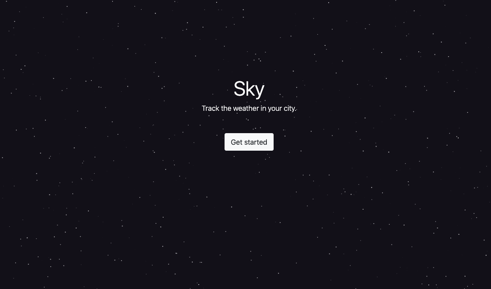

# Sky
*Sky* is a weather web application for users to check the weather in their city. 

Using HTML/CSS, Bootstrap, and Javascript, Sky uses the OpenWeather API in order to access geographic and weather-related data to relay to the user. The user is able to query via Sky to OpenWeather in order to view the current weather forecast in their city.
